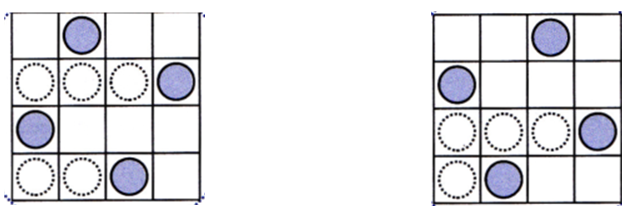
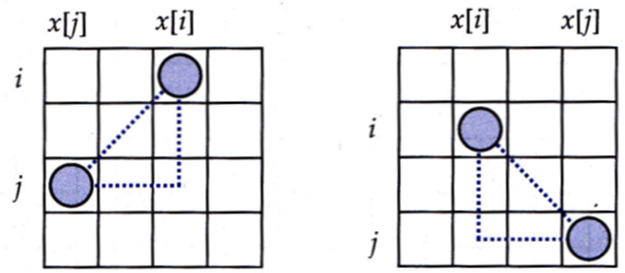

### Backtracking

Backtracking ist ein systematisches Ausprobieren. Wenn wir in eine Sackgasse geraten sind, gehen wir zurück (backtrack) und probieren die nächste Variante aus. Meistens sind alle möglichen Lösungen gefragt.
Backtracking ist anwendbar, wenn wir eine Lösung schrittweise aufbauen können und wenn wir für eine Teillösung die möglichen Kandidaten aufzählen können, die die Teillösung erweitern.
Beim Backtracking wird eine Teillösung immer wieder verändert. Erst wenn eine Lösung gefunden wird, wird eine Kopie gesichert.
Eine Teillösung bezeichnen wir mit a. a ist eine Liste mit Entscheidungen, die zur Lösung führen sollen.

Die Funktionen im Muster kann man im konkreten Fall kompakter in die back-Funktion integrieren. 
```
def back(a):
    if isSolution(a):
        solutions.append(a.copy())
    for cand in candidates(a):
        if isGood(cand,a):
            a.append(cand)
            # ggf weitere Operationen
            back(a)
            # ggf weitere Operationen rückgängig machen
            a.pop()
                
def isSolution(a):
    '''
    returns: True, wenn die Teillösung a eine Lösung darstellt
    '''
    pass

def candidates(a):
    '''
    returns: Liste von Entscheidungen, die die Teillösung a um eine Stufe erweitern können
    '''
    pass

def isGood(cand, a):
    '''
    returns: True, wenn die Entscheidung cand die Teillösung a sinnvoll erweitert.
    '''
    pass

solutions = []
back([])
print(solutions)
```

#### Beispiel: 8-Damenproblem
Wieviel Möglichkeiten gibt es, 8 Damen auf einem Schachbrett so zu plazieren, dass sich keine zwei Damen bedrohen?




```
def queens(n):
    '''
    a = [3,1] bedeutet: 1.Dame in Zeile 0, Spalte 3, 2.Dame in Zeile 1, Spalte 1    
    '''

    def back(a):
        if len(a) == n:
            solutions.append(a.copy())
        for cand in range(n):
            if isGood(a,cand):
                a.append(cand)
                back(a)
                a.pop()   
    
    def isGood(a,cand):
        '''
        prüft, ob der Kandidat cand die Teillösung a um ein Element erweitert.
        '''
        for j in range(len(a)):
            if a[j] == cand: return False
            if len(a) - j == abs(cand-a[j]): return False
        return True
    
    def printLoesung(a):
        for j in range(n):
            for i in range(n):
                if a[j] == i: zeichen = 'X'
                else: zeichen = '_'
                print(f"|{zeichen}",end='')
            print('|')
        print()

    solutions = []
    back([])
    for k, a in enumerate(solutions):
        print(f'Lösung {k+1}:')
        printLoesung(a)

queens(4)
```
Bedingung für eine diagonale Bedrohung: $j-i = abs(a[j]-a[i])$
(im Bild wird x statt a verwendet).



----

Zur Übung sollen alle Aufgaben mit backtracking gelöst werden.

#### Aufgabe: Jugendherberge

In der Jugendherberge organisiert man jeden Abend ein Lagerfeuer. Am ersten Abend setzen
sich alle Jugendlichen rund ums Feuer. Am zweiten Abend nehmen sie so Platz, dass die, 
die am ersten Abend Nachbarn waren, diesmal nicht nebeneinander sitzen. 
Bestimme alle Möglichkeiten, wie sie sich am zweiten Abend setzen können. Wir nehmen an,
dass sie am ersten Abend mit 1,2,3,...,n nummeriert sind.

#### Aufgabe: Permutationen

Implementiere die Funktion mit backtracking.

``` 
def permutationen(n):
    '''
    returns: Liste aller Permutationen von 0...n-1 als Listen.

    >>> permutationen(3)
    [[0, 1, 2], [0, 2, 1], [1, 0, 2], [1, 2, 0], [2, 0, 1], [2, 1, 0]]

    '''
    pass
```


#### Aufgabe: Referate

Die Erdkunde-Lehrerin möchte, dass die Schülerinnen und Schüler Referate halten, und verteilt die Themen.
Sie hat für die n Schülerinnen und Schüler m Themen vorbereitet (m <= n), von denen jedes mindestens einmal bearbeitet werden soll.
Welche Möglichkeiten gibt es, die Themen zu verteilen?

```
def referate(n, m):
    '''
    >>> referate(3, 2)
    Es gibt 6 Möglichkeiten:
    1 1 2
    1 2 1
    1 2 2
    2 1 1
    2 1 2
    2 2 1
    '''
    pass
```

#### Aufgabe: Summe von Kombinationen

Welche Möglichkeiten gibt es, aus einer Liste von natürlichen Zahlen eine gegebene Summe (target) zu bilden?


```
def combinationSum(b, target):
    '''
    b: Liste mit natürlichen Zahlen
    returns: Liste aller Kombinationen von Elementen aus b, die in der Summe target ergeben.

    >>> combinationSum([2,3,6,7],7)
    [[2, 2, 3], [7]]
    '''
    pass
```

#### Aufgabe: Springerzüge

Wieviele Möglichkeiten gibt es, auf einem 5x5-Schachbrett von einer gegebenen Position mit einem Springer alle Felder zu erreichen?

#### Aufgabe: Nikolaus

Wieviele verschiedene Möglichkeiten gibt es, das Haus vom Nikolaus zu zeichnen?

#### Aufgabe: Sudoku

Prüfe, ob eine gegebenes Sudoku genau eine Lösung hat und gib die Lösung an.


